# 竞争战略 - 图形版思维导图

## 整体结构概览

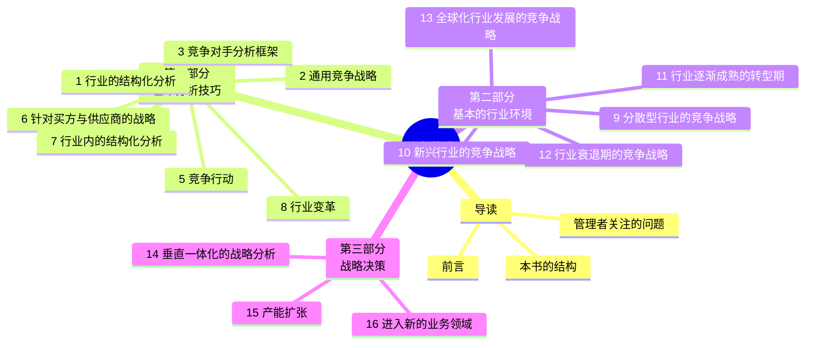

---

## 第一部分：基本分析技巧

### 1. 五大竞争力模型

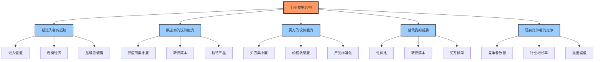

### 2. 三大通用战略

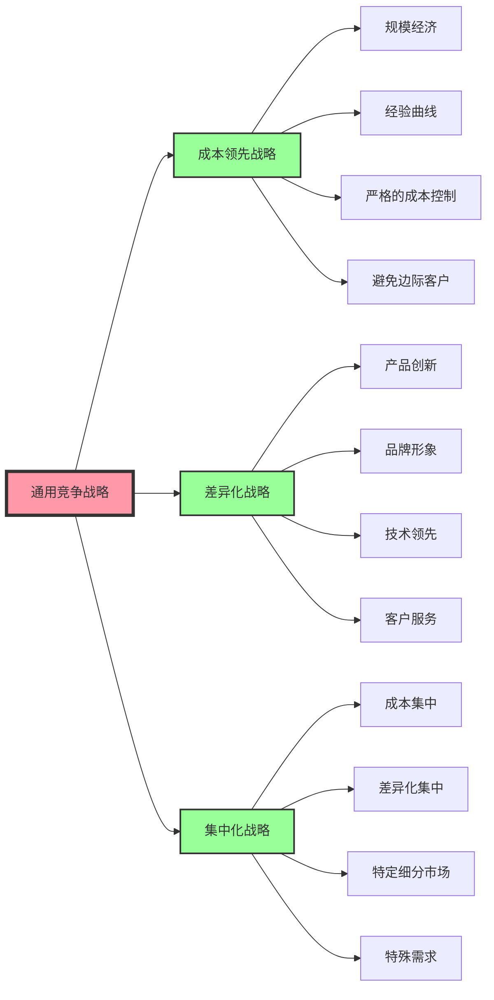

### 3. 竞争对手分析

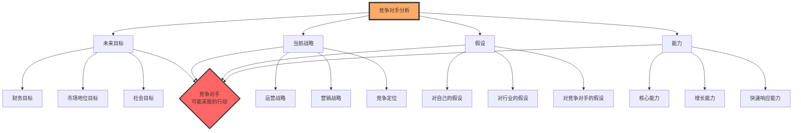

---

## 第二部分：基本的行业环境

### 9. 分散型行业

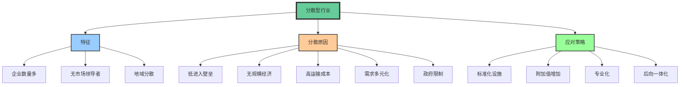

### 10. 新兴行业

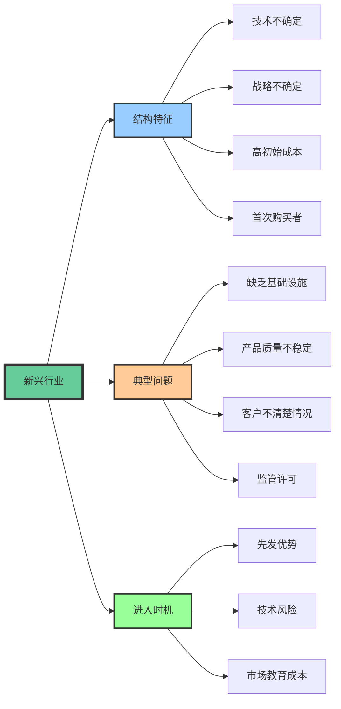

### 11. 行业成熟期

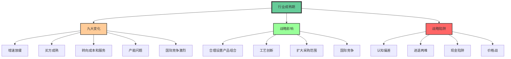

### 12. 行业衰退期

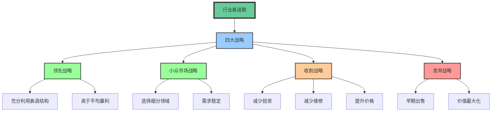

### 13. 全球化行业

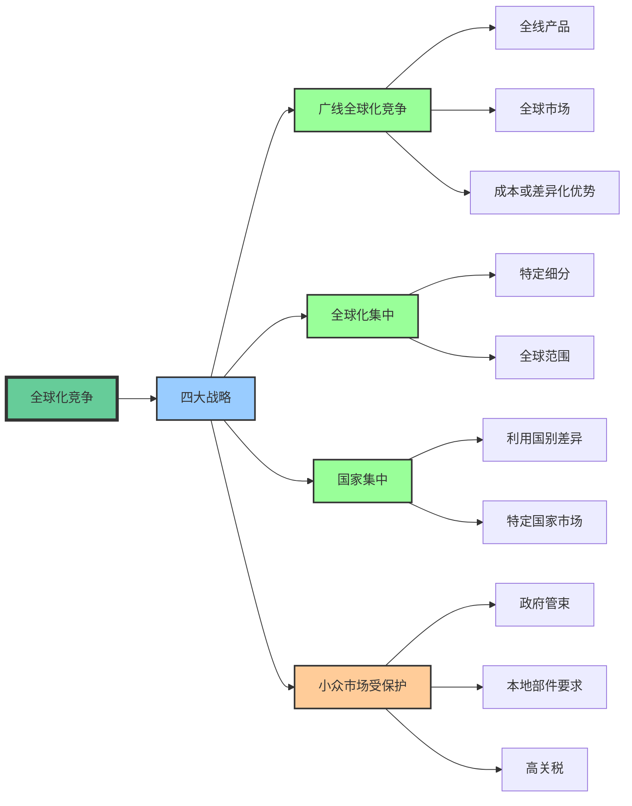

---

## 第三部分：战略决策

### 14. 垂直一体化

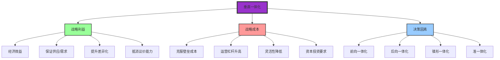

### 15. 产能扩张

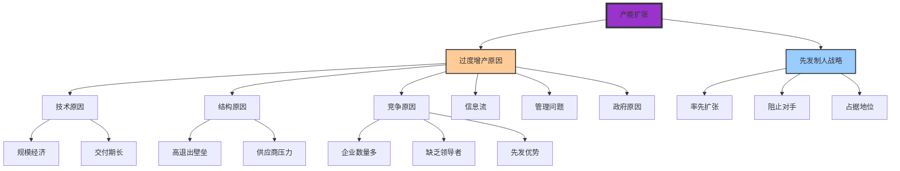

### 16. 进入新业务

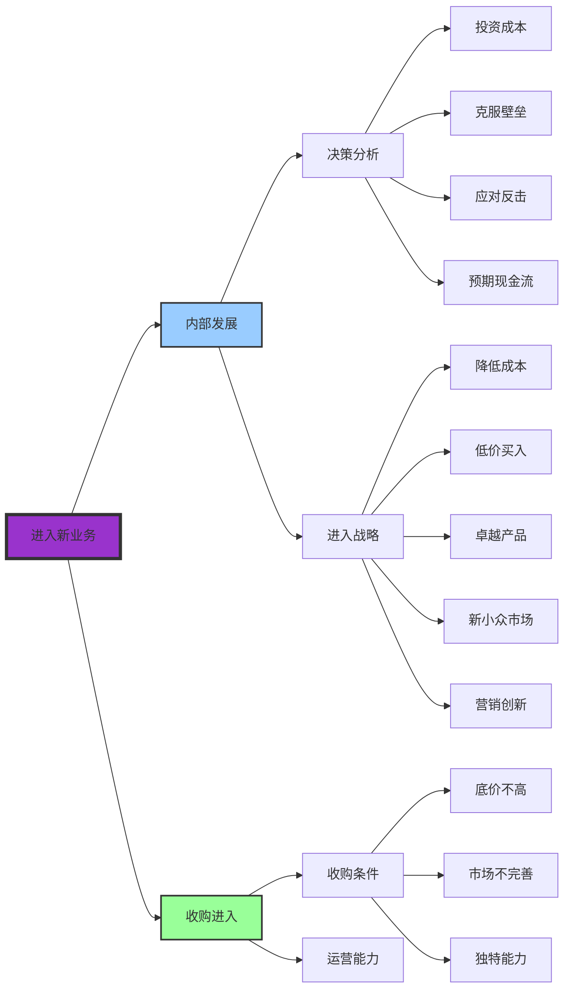

---

## 核心框架总结

### 战略分析三部曲

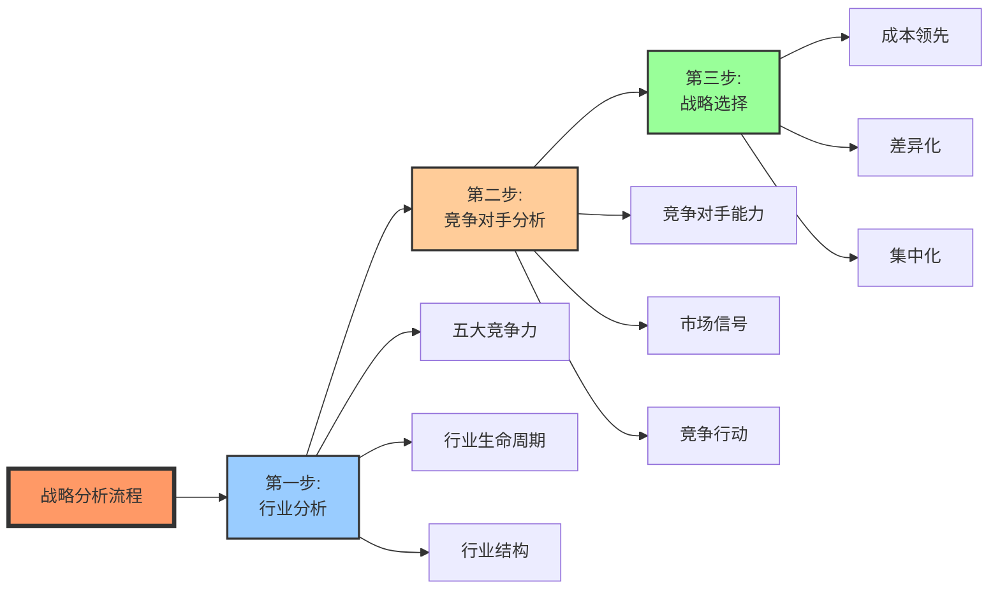

---

## 如何使用本思维导图

### 📖 阅读建议

1. **第一遍阅读** - 先看整体结构，理解全书框架
2. **第二遍阅读** - 重点关注与您当前业务相关的章节
3. **第三遍阅读** - 结合实际案例，深入理解战略工具

### 🎯 实战应用

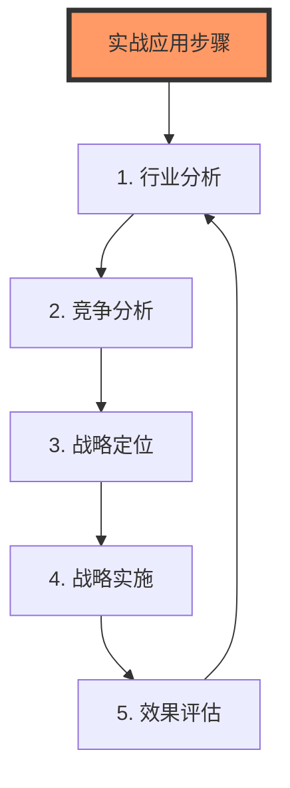

---

**提示：** 以上图形使用 Mermaid 格式绘制，在支持 Mermaid 的 Markdown 编辑器中可以看到可视化效果。

**推荐工具：**
- Typora
- VS Code (with Mermaid extension)
- Obsidian
- Notion
